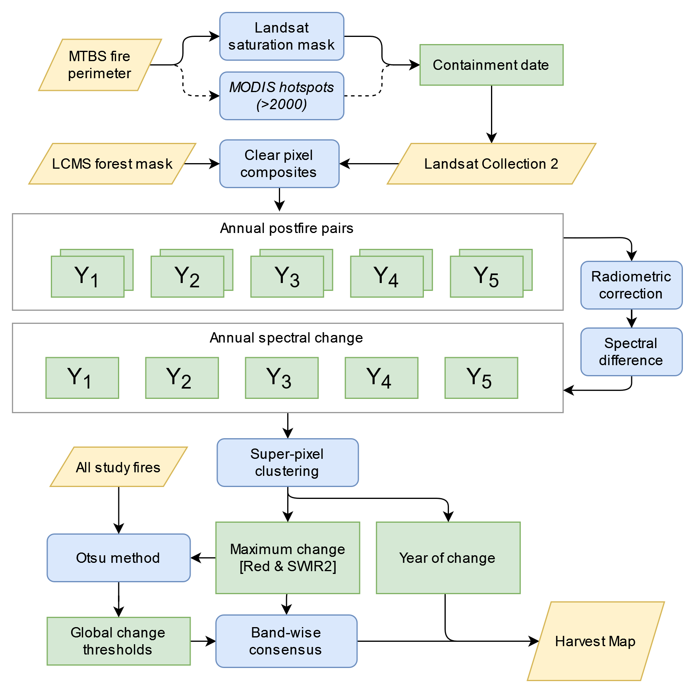

# Long-Term Patterns of Post-Fire Harvest Diverge Among Ownerships in the Pacific West

</img>

## Repository Layout

- `src/pfh/` - Library functions for generating post-fire harvest maps and ancillary data in Earth Engine.
- `src/pfh/scripts/` - Scripts to run post-fire harvest mapping and generate raw data and results.
- `R/` - R scripts for time series intervention analysis.
- `notebooks/` - Jupyter notebooks for data analysis and visualization.
- `tests/` - Unit tests for the library functions.
- `paper.ipynb` - An interactive demo that applies the study methods to a single fire.

## Running

### Setup

This project uses [hatch](https://hatch.pypa.io/latest/) for reproducible builds. To install the project, ensure that Python >= 3.8 is installed, then run:

```bash
pip install hatch
hatch shell
```

This will enter a virtual environment with the project dependencies installed. To exit the virtual environment, run `exit`.

### Reproducing the Paper

To generate the analysis data for the paper, you can run a series of scripts that will process and export data to Earth Engine assets and Google Drive storage. 

1. Edit `src/pfh/scripts/config.py` as needed. The scripts below export intermediate assets, so set an appropriate asset directory.
2. Run `python -m src.pfh.scripts._00_build_collections` to generate empty asset collections.
3. Run `python -m src.pfh.scripts._01_study_fires` to filter and export the study fires to an asset. Wait for asset export to complete before moving to next step.
4. Run `python -m src.pfh.scripts._02_build_composites` to generate composites showing the magnitude and timing of the maximum spectral change for each fire. One composite is generated per fire year. Wait for asset exports to complete before moving to next step.
5. Run `python -m src.pfh.scripts._03_otsu_thresholds` to calculate change thresholds in the SWIR2 and Red bands. The thresholds are stored in a Feature Collection asset. Wait for the export to complete before moving to the next step.
6. Run `python -m src.pfh.scripts._04_harvest_maps` to generate the final harvest maps. These are exported to the asset directory, with one image per fire year.
7. Run `python -m src.pfh.scripts._05_ancillary_data` to generate ancillary data for analysis, e.g. annual NBR composites and ownership maps.
8. Run `python -m src.pfh.scripts._06_process_results` to export harvest patch areas and tabular areas of harvest stratified by year, region, ownership, timing, and severity class to Google Drive.
9. Run analysis in the notebooks and R scripts.

### Running Interactively

Run `paper.ipynb` to interactively map harvests in a test fire. This notebook demonstrates the methods used in the paper.

> [!IMPORTANT]
> The methods and results in the paper were validated at the regional level in the Pacific West, and may produce poor results at the individual fire level or in other regions.
